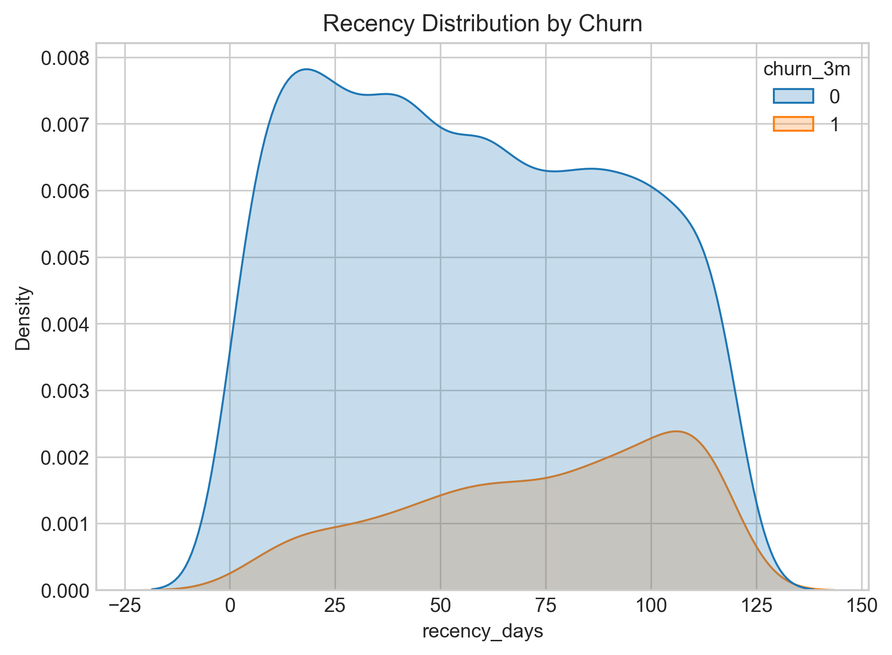
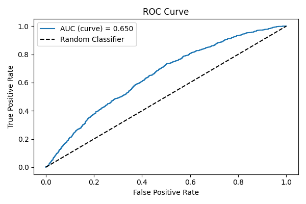
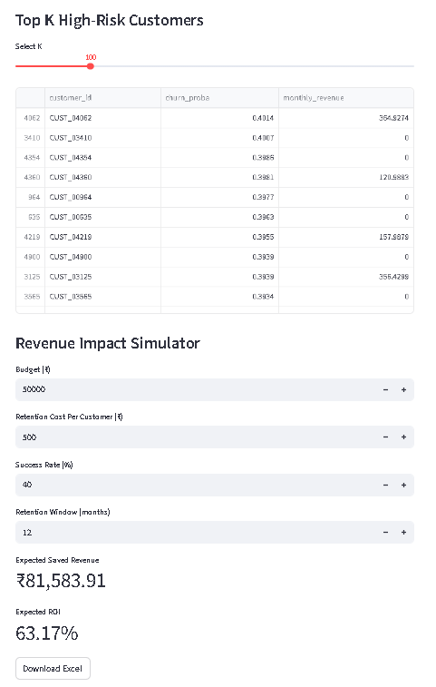
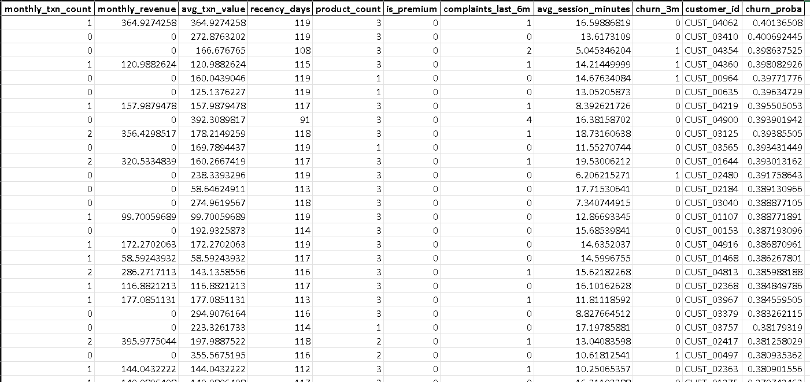

# 🏦 Customer Churn Prediction & Revenue Impact Simulator (Fintech)

An industry-oriented, end-to-end machine learning project designed to analyze customer behavior, predict churn, and simulate revenue impact for targeted retention campaigns.

---

# 📌 1. Project Summary
This project predicts **which fintech customers are most likely to churn** and estimates the **financial impact** of retention campaigns using a business-focused ROI simulator built with Streamlit.

---

# 🚨 2. Problem Statement & Business Impact

Customer churn is one of the biggest challenges in fintech, where the cost of acquiring a customer is high.  
By predicting churn early and quantifying potential revenue loss, companies can:

- Target high-value customers more efficiently  
- Reduce overall churn  
- Improve customer lifetime value (LTV)  
- Make data-backed retention decisions  
- Measure ROI before executing a marketing campaign  

This project creates a system that does exactly that.

---

# 📊 3. Key EDA Insights (From `EDA.ipynb`)

The EDA revealed strong behavioral patterns:

### 🔹 **1. Inactive customers are more likely to churn**
- Customers with higher **recency_days** show significantly higher churn probability.

### 🔹 **2. Low transaction activity signals disengagement**
- Users with **low monthly_txn_count**  
- And **low monthly_revenue**  
are more likely to churn.

### 🔹 **3. Premium customers churn less**
- Premium users display higher retention and stronger engagement signals.

### 🔹 **4. Complaints increase churn likelihood**
- Even a single complaint in the last 6 months shows a visible spike in churn rate.

### 🔹 **5. Active app users churn less**
- Higher **avg_session_minutes** correlates with low churn.

### 🔹 **6. Correlation Heatmap**
Shows:
- **recency_days** has strongest positive correlation with churn  
- Usage-based features (revenue, sessions, txn_count) negatively correlate with churn  

These insights directly guide model feature selection and business strategy.

---

# 🖼️ 4. Demo Screenshots

### 📈 EDA Snapshot — *Recency vs Churn*


### 📉 Model ROC Curve


### 🧮 Streamlit Dashboard — *Top-K Risk + ROI*


### 📄 Sample Excel Export (Targeted Customers)


---

# 🧠 5. Tech Stack

- **Python 3.10+**
- **Machine Learning:** Pandas, NumPy, Scikit-Learn  
- **Visualizations:** Matplotlib, Seaborn  
- **Deployment/UI:** Streamlit, Flask  
- **Utilities:** Joblib, Openpyxl  
- **Testing:** PyTest  

---

# ⚙️ 6. Quick Start

### Clone repository
```sh
git clone https://github.com/girishshenoy16/Fintech-Customer-Churn-Prediction.git
cd Fintech-Customer-Churn-Prediction
```

### Create virtual environment
```sh
python -m venv .venv
.\.venv\Scripts\activate
```

### Install dependencies
```sh
python.exe -m pip install --upgrade pip
pip install -r requirements.txt
```

---

# ▶️ 7. How to Run the Project

### 1️⃣ Generate synthetic data
```sh
python scripts/generate_synthetic.py
```

### 2️⃣ Preprocess data
```sh
python src/data_preprocessing.py --input data/raw/sample_raw.csv --output data/processed/train_features.csv
```

### 3️⃣ Train churn model
```sh
python src/train_model.py --input data/processed/train_features.csv --output models/churn_model.pkl
```

### 4️⃣ Evaluating the Model 
```sh
python src/evaluate_model.py
```

### 5️⃣ Testing the Model 
```sh
python -m pytest
```

### 6️⃣ Launch Streamlit App
```sh
streamlit run app/streamlit_app.py
```

---

# 🗂️ 8. Project Structure

```
Fintech-Customer-Churn-Prediction/
│── app/
│   └── streamlit_app.py
│
│── data/
│   ├── processed/
│   │   └── train_features.csv
│   │
│   └── raw/
│       └── sample_raw.csv
│
│── models/
│   └── best_model.pkl
│
│── notebooks/
│   └── EDA.ipynb
│
├── screenshots/
│   ├── Recency_Distribution_By_Churn.png
│   ├── roc_curve.png
│   ├── streamlit_dashboard.png
│   └── targeted_customers.png
│
│── scripts/
│   └── generate_synthetic.py
│ 
│── src/
│   ├── api.py
│   ├── data_preprocessing.py
│   ├── evaluate_model.py
│   ├── predict.py
│   └── train_model.py
│ 
│── tests/
│   └── test_predict.py
│
│── README.md
└── requirements.txt
```

---

## ▶️ How to Run the Project


### **1. Clone the repository**

```sh
git clone https://github.com/girishshen/Churn-Fintech-Simulator.git
cd Churn-Fintech-Simulator
```

---

### 2. Create venv

```sh
python -m venv .venv
..venv\Scripts\Activate.ps1
```

### 3. Install dependencies

```sh
python.exe -m pip install --upgrade pip
pip install -r requirements.txt
```

### 4. Generate synthetic dataset

```sh
python scripts/generate_synthetic.py
```

### 5. Preprocess data

```sh
python src/data_preprocessing.py --input data/raw/sample_raw.csv --output data/processed/train_features.csv
```

### 6. Train model

```sh
python src/train_model.py --input data/processed/train_features.csv --output models/churn_model.pkl
```

### 7. Launch Streamlit App

```sh
streamlit run app/streamlit_app.py
```

---

## 📊 Results
- Model: Logistic Regression
- Example AUC: ~0.60–0.85
- Precision@TopK: 3–4× better than random  
- ROI Positive in most simulations

---

## ✨ Future Scope
- XGBoost model
- Deployment to AWS/GCP
- Real-time scoring via Kafka + Redis
- SHAP explainability