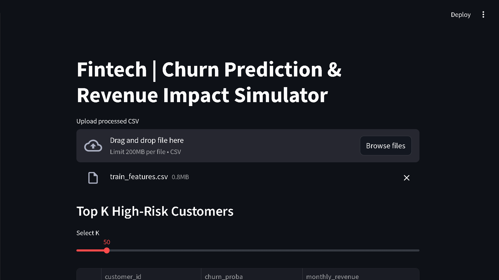
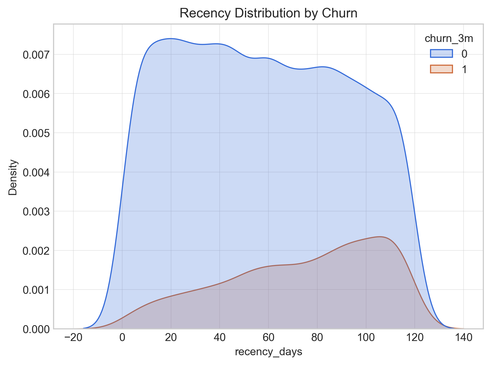
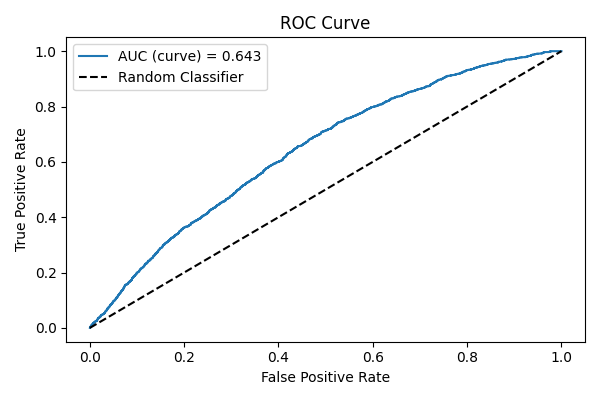
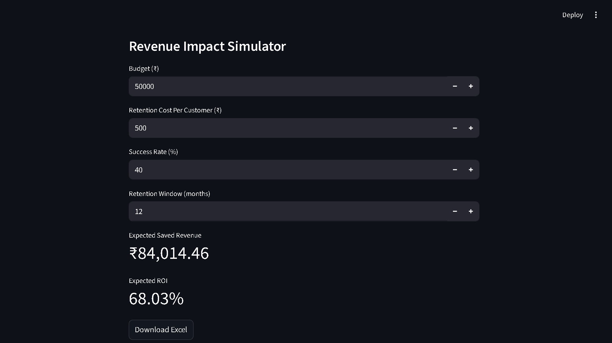
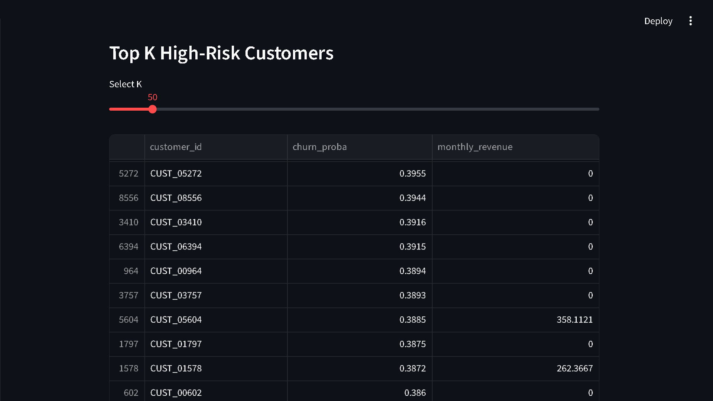

# 🌟 Fintech Customer Churn Prediction & Revenue Impact Simulator

### AI-Powered Customer Retention Intelligence System • Streamlit • Machine Learning • Revenue Simulation

---

<div align="center">



<br/>

<i>Customer Retention Intelligence Platform with Churn Prediction, Risk Segmentation & Revenue Impact Simulation</i>

<br/>


</div>

---

# 🖼️ Project Overview

An industry-oriented end-to-end analytics and machine learning project designed to identify high-risk customers, 
analyze churn behavior, and simulate revenue impact for retention strategies in fintech and banking environments.

This project combines:
- Customer Churn Prediction
- Revenue Impact Simulation
- Customer Risk Segmentation
- KPI-Based Retention Intelligence
- Interactive Streamlit Dashboards
- Exportable Targeting Workflows

Built using:
- Python
- Pandas & NumPy
- Scikit-learn
- Plotly
- Logistic Regression
- Streamlit

---

# 🚀 Business Problem

Customer churn is one of the most critical business problems in fintech and banking industries. Acquiring new customers is expensive, and losing existing customers directly impacts long-term revenue and profitability.

Organizations often struggle to:
- identify high-risk customers early
- prioritize retention campaigns effectively
- estimate retention ROI
- visualize churn trends
- monitor revenue exposure

This project demonstrates how machine learning and analytics can support:
- proactive customer retention
- targeted marketing strategies
- retention KPI monitoring
- revenue optimization
- executive decision-making

---

# 🎯 Business Objectives

- Predict customers likely to churn
- Prioritize high-risk customer segments
- Simulate retention campaign ROI
- Quantify revenue at risk
- Support business-focused decision-making
- Build executive-level analytics dashboards

---

# 📊 Key EDA Insights

The exploratory data analysis revealed several important customer behavior patterns.

### 🔹 Inactive customers are more likely to churn
Customers with high `recency_days` showed significantly higher churn probability.

### 🔹 Lower transaction activity increases churn risk
Customers with:
- low transaction count
- low monthly revenue
- lower engagement

were more likely to churn.

### 🔹 Premium users demonstrate stronger retention
Premium customers showed:
- higher engagement
- lower churn rates
- better retention stability

### 🔹 Complaints strongly correlate with churn
Even small increases in complaints significantly increased churn probability.

### 🔹 Engagement metrics negatively correlate with churn
Higher activity and usage patterns reduced churn likelihood.

---

# 🧠 Key Features

| Module                   | Function                           |
|--------------------------|------------------------------------| 
| 📈 KPI Dashboard         | Business KPI monitoring            |
| 🤖 Churn Prediction      | ML-based customer churn prediction |
| 👥 Customer Segmentation | High-risk customer identification  |
| 💰 ROI Simulator         | Revenue impact estimation          |
| 📤 Export Engine         | Export targeted customers          |
| 🌐 Streamlit UI          | Interactive business dashboard     |

---

# 📸 Demo Screenshots

## ⭐ EDA Snapshot — Recency vs Churn

<div align="center">
  
</div>


## ⭐ Model ROC Curve

<div align="center">
  
</div>


## ⭐ Streamlit Dashboard — Top-K Risk + ROI

<div align="center">
  
</div>


## ⭐ Revenue Impact Simulation Dashboard

<div align="center">
  
</div>


### 📌 Revenue Simulation Features

The Revenue Impact Simulator allows business teams to dynamically configure:

- Retention campaign budget
- Retention cost per customer
- Expected campaign success rate
- Retention campaign duration

The simulator automatically estimates:
- Expected saved revenue
- Revenue recovery potential
- Campaign profitability
- Estimated ROI (%)

This mirrors real-world customer retention analytics workflows used in fintech and banking industries.

<br/>

## ⭐ Targeted Customer Export Preview

<div align="center">
  
</div>

---

# 📈 Model Performance & Business Outcomes

| Metric              | Result                                 |
|---------------------|----------------------------------------|
| Model Used          | Logistic Regression                    |
| Classification Type | Binary Churn Prediction                |
| Example AUC         | ~0.60–0.85                             |
| Precision@TopK      | 3–4× better than random                |
| Business Goal       | Customer Retention Optimization        |
| Dashboard Type      | Interactive Streamlit Analytics System |

---

# 🧬 System Workflow

```text
Customer Data
      ↓
Data Cleaning & Preprocessing
      ↓
Feature Engineering
      ↓
Customer Churn Prediction Model
      ↓
Risk Probability Scoring
      ↓
Revenue Impact Simulation
      ↓
Interactive Streamlit Dashboard
      ↓
Retention Insights & Export Workflows
````

---

# 🧩 End-to-End Workflow

1. Generate synthetic fintech/banking customer data
2. Perform exploratory data analysis (EDA)
3. Clean and preprocess customer behavior data
4. Engineer churn-related behavioral features
5. Train churn prediction model
6. Evaluate customer churn probabilities
7. Identify high-risk customers
8. Simulate retention campaign ROI
9. Build Streamlit dashboard for data-driven retention insights
9. Export targeted customer lists for retention workflows

---

# 🧠 Tech Stack

* **Language:** Python 3.10+
* **Machine Learning:** Pandas, NumPy
* **ML Models:** Scikit-Learn, Random Forest, Logistic Regression
* **Visualization:** Matplotlib, Seaborn, Plotly
* **Dashboard/UI:** Streamlit 
* **Utilities:** Joblib, Openpyxl
* **Testing:** PyTest

---

# 📁 Project Structure

```text
Fintech-Customer-Churn-Prediction/
│
├── app/
│   └── streamlit_app.py
│
├── data/
│   ├── processed/
│   │   └── train_features.csv
│   │
│   └── raw/
│       └── sample_raw.csv
│
├── models/
│   └── best_model.pkl
│
├── notebooks/
│   └── EDA.ipynb
│
├── screenshots/
│   ├── Recency_Distribution_By_Churn.png
│   ├── roc_curve.png
│   ├── revenue_simulator.png
│   ├── streamlit_dashboard.png
│   └── targeted_customers.png
│
├── scripts/
│   └── generate_synthetic.py
│
├── src/
│   ├── __init__.py
│   ├── evaluate_model.py
│   ├── train_model.py
│   ├── predict.py
│   └── data_preprocessing.py
│
├── tests/
│   └── test_predict.py
│
├── README.md
└── requirements.txt
```

---

# ⚙️ Installation

## 1️⃣ Clone Repository

```bash
git clone https://github.com/girishshenoy16/Fintech-Customer-Churn-Prediction.git

cd Fintech-Customer-Churn-Prediction
```


## 2️⃣ Create Virtual Environment

```bash
python -m venv 

.\venv\Scripts\activate
```


## 3️⃣ Install Dependencies

```bash
python.exe -m pip install --upgrade pip

pip install -r requirements.txt
```


# ▶️ Running the Project

## 1️⃣ Generate Synthetic Data

```bash
python scripts/generate_synthetic.py
```


## 2️⃣ Run EDA Notebook

Launch Jupyter Notebook:

```bash 
jupyter notebook
```

Then open:

```plaintext 
notebooks/EDA.ipynb
```

Run all notebook cells to:

* perform exploratory data analysis
* visualize churn behavior
* analyze customer engagement patterns
* study churn correlations & insights


## 3️⃣ Preprocess Data

```bash 
python src/data_preprocessing.py --input data/raw/sample_raw.csv --output data/processed/train_features.csv
```


## 4️⃣ Train Churn Model

```bash 
python src/train_model.py --input data/processed/train_features.csv --output models/churn_model.pkl
```


## 5️⃣ Evaluate Model

```bash 
python src/evaluate_model.py
```

This generates:
- ROC Curve
- Model metrics
- Evaluation charts


## 6️⃣ Run Tests

```bash 
python -m pytest
python -m pytest -v 
python -m pytest -q
```


## 7️⃣ Launch Streamlit Dashboard

```bash 
streamlit run app/streamlit_app.py
```

---

# 🧪 Testing

The project uses PyTest for validating:
- model loading
- prediction pipeline
- preprocessing functions
- inference workflows

Run tests:

```bash
python -m pytest -v
```

---

# 🔮 Future Scope

* XGBoost & LightGBM-based churn modeling
* SHAP-based explainability dashboards
* Real-time customer churn monitoring
* Cloud deployment 
* MLOps integration
* Automated retraining pipelines
* Automated retention campaign recommendations
* Personalized retention strategy simulation
* Customer lifetime value (CLV) modeling
* Multi-class churn risk categorization
* Deep learning-based behavioral analytics
* Kafka-based event streaming
* Enterprise-scale customer intelligence systems

---

# 🤝 Contribution

Contributions, suggestions, and improvements are welcome.

If you found this project valuable, consider starring the repository.

---

<div align="center">

### ⚡ AI-Powered Customer Retention Intelligence for Smarter Business Decisions

</div>